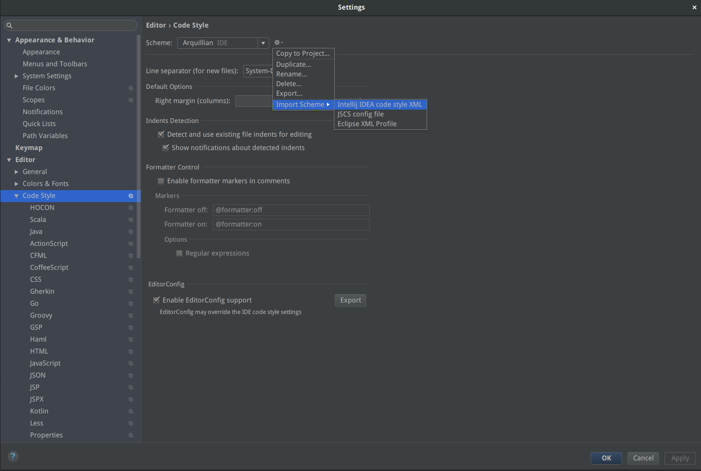

= Arquillian shared settings

This repository hosts shared settings among all projects under Arquillian Organization

== Code Settings

Code settings for all Arquillian projects.

=== IntelliJ IDEA

In order to import `arquillian-idea-code-style.xml` to the your editor go to `[Settings] -> [Code Style]` and then next to `Scheme` selection on the top click `Import schemes`. As shown on the image below.

